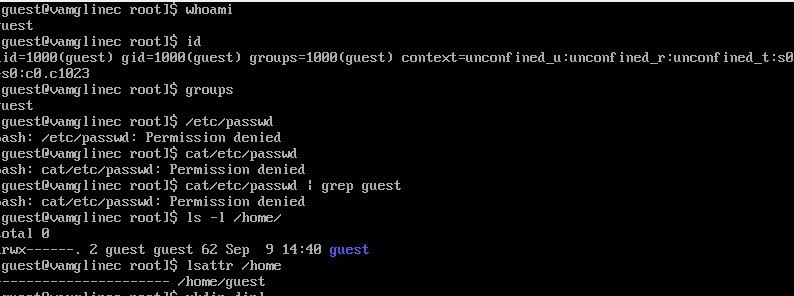
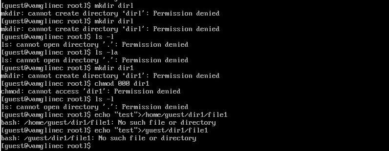

---
## Front matter
lang: ru-RU
title: Презентация по лабораторной работе №2
subtitle: Основы информационной безопасности
author:
  - Мглинец В. А.
institute:
  - Российский университет дружбы народов, Москва, Россия

date: 09 сентября 2024

## i18n babel
babel-lang: russian
babel-otherlangs: english

## Formatting pdf
toc: false
toc-title: Содержание
slide_level: 2
aspectratio: 169
section-titles: true
theme: metropolis
header-includes:
 - \metroset{progressbar=frametitle,sectionpage=progressbar,numbering=fraction}
---

# Информация

## Докладчик

:::::::::::::: {.columns align=center}
::: {.column width="70%"}

  * Мглинец Варвара Александровна
  * студент
  * НПМбд-02-21
  * Российский университет дружбы народов
:::
::: {.column width="30%"}

:::
::::::::::::::

# Вводная часть

# Цель работы

Получение практических навыков работы в консоли с атрибутами файлов, закрепление теоретических основ дискреционного разграничения доступа в современных системах с открытым кодом на базе ОС Linux

# Задание

1. Работа с атрибутами файлов
2. Заполнение таблицы "Установленные права и разрешённые действия" (см. табл. 2.1)
3. Заполнение таблицы "Минимальные права для совершения операций" (см. табл. 2.2)

# Теоретическое введение

**Операционная система** — это комплекс программ, предназначенных для управления ресурсами компьютера и организации взаимодействия с пользователем. [1]

**Права доступа** определяют, какие действия конкретный пользователь может или не может совершать с определенным файлами и каталогами. С помощью разрешений можно создать надежную среду — такую, в которой никто не может поменять содержимое ваших документов или повредить системные файлы. [2].
 

# Выполнение лабораторной работы

##1

В установленной при выполнении предыдущей лабораторной работы ОС созда-
ла учётную запись пользователя guest с помощью команды “sudo useradd guest”
и задала пароль для этого пользователя командой “sudo passwd guest” и вошла в систему от имени пользователя guest.Командой “pwd” определила, что нахожусь в директории /home/guest, которая
и является моей домашней директорией. С приглашением командной строки совпадает.

{#fig:001 width=70%}

##2

Уточнила имя моего пользователя командой “whoami” и получила вывод: guest. С помощью команды “id” определила имя своего пользователя - всё так же guest, uid = 1000 (guest), gid = 1000 (guest). Затем сравнила полученную информацию с выводом команды “groups”, которая вывела “guest”. Мой пользователь входит только в одну группу, состоящую из него самого, поэтому вывод обеих команд “id” и “groups” совпадает. Данные, выводимые в приглашении командной строки, совпадают с полученной информацией.
Затем просмотрела файл /etc/passwd командой “cat /etc/passwd. Нашла в нём свою учётную запись в самом конце (рис. 3.5). Uid = 1000, gid = 1000, то есть они совпадают с тем, что мы получили ранее.
Далее посмотрела, какие директории существуют в системе командой “ls -l /home/”. Список поддиректорий директории /home получить не удалось. 
Проверила, какие расширенные атрибуты установлены на поддиректориях,
находящихся в директории /home, командой “lsattr /home”. Не удалось
увидеть расширенные атрибуты только директории.

##3

{#fig:002 width=70%}

Попыталась создать в домашней директории поддиректорию dir1 командой “mkdir dir1”, доступ был отклонён.
Попыталась создать в директории dir1 файл file1 командой echo “test” > /home/guest/dir1/file1. Этого сделать не получилось, т.к. предыдущим действием мы убрали право доступа на запись в директории. В итоге файл не был создан (открыть директорию с помощью команды “ls -l /home/guest/dir1” изначально тоже не удалось по той же причине, поэтому я поменяла права доступа и снова воспользовалась этой командой, и тогда смогла просмотреть содержимое директории, убедившись, что файл не был создан).

{#fig:003 width=70%}

{#fig:004 width=70%}

## Вывод

Были получены практические навыки работы в консоли с атрибутами файлов, закреплены теоретические основы дискреционного разграничения доступа в современных системах с открытым кодом на базе ОС Linux.

:::

