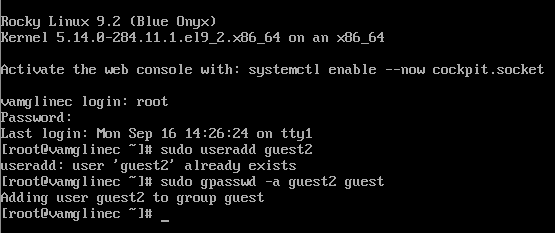
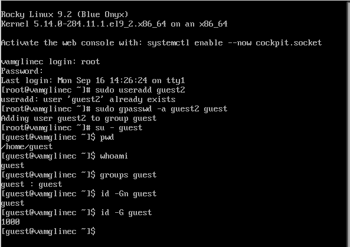
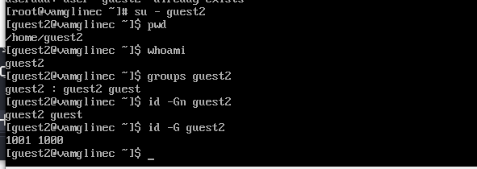
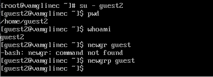

---
## Front matter
title: "Отчет по лабораторной работе №3"
subtitle: "Основы информационной безопасности"
author: "Мглинец Варвара, НПМбд-02-21"

## Generic otions
lang: ru-RU
toc-title: "Содержание"

## Bibliography
bibliography: bib/cite.bib
csl: pandoc/csl/gost-r-7-0-5-2008-numeric.csl

## Pdf output format
toc: true # Table of contents
toc-depth: 2
lof: true # List of figures
lot: true # List of tables
fontsize: 12pt
linestretch: 1.5
papersize: a4
documentclass: scrreprt
## I18n polyglossia
polyglossia-lang:
  name: russian
  options:
	- spelling=modern
	- babelshorthands=true
polyglossia-otherlangs:
  name: english
## I18n babel
babel-lang: russian
babel-otherlangs: english
## Fonts
mainfont: IBM Plex Serif
romanfont: IBM Plex Serif
sansfont: IBM Plex Sans
monofont: IBM Plex Mono
mathfont: STIX Two Math
mainfontoptions: Ligatures=Common,Ligatures=TeX,Scale=0.94
romanfontoptions: Ligatures=Common,Ligatures=TeX,Scale=0.94
sansfontoptions: Ligatures=Common,Ligatures=TeX,Scale=MatchLowercase,Scale=0.94
monofontoptions: Scale=MatchLowercase,Scale=0.94,FakeStretch=0.9
mathfontoptions:
## Biblatex
biblatex: true
biblio-style: "gost-numeric"
biblatexoptions:
  - parentracker=true
  - backend=biber
  - hyperref=auto
  - language=auto
  - autolang=other*
  - citestyle=gost-numeric
## Pandoc-crossref LaTeX customization
figureTitle: "Рис."
tableTitle: "Таблица"
listingTitle: "Листинг"
lofTitle: "Список иллюстраций"
lotTitle: "Список таблиц"
lolTitle: "Листинги"
## Misc options
indent: true
header-includes:
  - \usepackage{indentfirst}
  - \usepackage{float} # keep figures where there are in the text
  - \floatplacement{figure}{H} # keep figures where there are in the text
---

# Цель работы

Получить практические навыки работы в консоли с атрибутами файлов для групп пользователей.

# Задание

1. Создание пользователя guest2, добавление его в группу пользователей guest
2. Заполнение таблицы 3.1
3. Заполнение таблицы 3.2 на основе таблицы 3.1.

# Теоретическое введение

**Права доступа** определяют, какие действия конкретный пользователь может или не может совершать с определенным файлами и каталогами. С помощью разрешений можно создать надежную среду — такую, в которой никто не может поменять содержимое ваших документов или повредить системные файлы. [1]

**Группы пользователей Linux** кроме стандартных root и users, здесь есть еще пару десятков групп. Это группы, созданные программами, для управления доступом этих программ к общим ресурсам. Каждая группа разрешает чтение или запись определенного файла или каталога системы, тем самым регулируя полномочия пользователя, а следовательно, и процесса, запущенного от этого пользователя. Здесь можно считать, что пользователь - это одно и то же что процесс, потому что у процесса все полномочия пользователя, от которого он запущен. [2]

- daemon - от имени этой группы и пользователя daemon запускаютcя сервисы, которым необходима возможность записи файлов на диск.
- sys - группа открывает доступ к исходникам ядра и файлам - include сохраненным в системе
- sync - позволяет выполнять команду /bin/sync
- games - разрешает играм записывать свои файлы настроек и историю в определенную папку
- man - позволяет добавлять страницы в директорию /var/cache/man
- lp - позволяет использовать устройства параллельных портов
- mail - позволяет записывать данные в почтовые ящики /var/mail/
- proxy - используется прокси серверами, нет доступа записи файлов на диск
- www-data - с этой группой запускается веб-сервер, она дает доступ на запись /var/www, где находятся файлы веб-документов
- list - позволяет просматривать сообщения в /var/mail
- nogroup - используется для процессов, которые не могут создавать файлов на жестком диске, а только читать, обычно применяется вместе с пользователем nobody.
- adm - позволяет читать логи из директории /var/log
- tty - все устройства /dev/vca разрешают доступ на чтение и запись пользователям из этой группы
- disk - открывает доступ к жестким дискам /dev/sd* /dev/hd*, можно сказать, что это аналог рут доступа.
- dialout - полный доступ к серийному порту
- cdrom - доступ к CD-ROM
- wheel - позволяет запускать утилиту sudo для повышения привилегий
- audio - управление аудиодрайвером
- src - полный доступ к исходникам в каталоге /usr/src/
- shadow - разрешает чтение файла /etc/shadow
- utmp - разрешает запись в файлы /var/log/utmp /var/log/wtmp
- video - позволяет работать с видеодрайвером
- plugdev - позволяет монтировать внешние устройства USB, CD и т д
- staff - разрешает запись в папку /usr/local

# Выполнение лабораторной работы

В установленной при выполнении предыдущей лабораторной работы ОС созда-
ла учётную запись пользователя guest2 (т.к. пользователь guest уже был создан
в прошлой лабораторной работе) с помощью команды “sudo useradd guest2” и
задала пароль для этого пользователя командой “sudo passwd guest2”. Добавила
пользователя guest2 в группу guest с помощью команды “sudo gpasswd -a guest2
guest”

{#fig:001 width=70%}

Затем осуществила вход в систему от двух пользователей на двух разных консолях при помощи команд “su - guest” и “su - guest2”. Определила командой “pwd”, что оба пользователя находятся в своих домашних директориях, что совпадает с приглашениями командной строки. Уточнила имена пользователей командой
“whoami”, соответственно получила: guest и guest2. С помощью команд “groups guest” и “groups guest2” определила, что пользователь guest входит в группу guest, а пользователь guest2 в группы guest и guest2. Сравнила полученную информа- цию с выводом команд “id -Gn guest”, “id -Gn guest2”, “id -G guest” и “id -G guest2”:данные совпали, за исключением второй команды “id -G”, которая вывела номера
групп 1001 и 1002, что также является верным 

{#fig:002 width=70%}

{#fig:003 width=70%}

Просмотрела файл /etc/group командой “cat /etc/group”, данные этого файла
совпадают с полученными ранее

От имени пользователя guest2 зарегистрировала этого пользователя в группе
guest командой “newgrp guest”. Далее от имени пользователя guest изменила
права директории /home/guest, разрешив все действия для пользователей группы
командой “chmod g+rwx /home/guest”. От имени этого же пользователя сняла с ди-
ректории /home/guest/dir1 все атрибуты командой “chmod 000 dir1” и проверила
правильность снятия атрибутов командой “ls -l” 

{#fig:004 width=70%}

Теперь заполним таблицу «Установленные права и разрешённые действия»
3.1, меняя атрибуты у директории и файла от имени пользователя guest и делая
проверку от пользователя guest2.
Создание файла: “echo”text” > /home/guest/dir1/file2”
Удаление файла: “rm -r /home/guest/dir1/file1”
Запись в файл: “echo”textnew” > /home/guest/dir1/file1”
Чтение файла: “cat /home/guest/dir1/file1”
Смена директории: “cd /home/guest/dir1”
Просмотр файлов в директории: “ls /home/guest/dir1”
Переименование файла: “mv /home/guest/dir1/file1 filenew”
Смена атрибутов файла: “chattr -a /home/guest/dir1/file1”


## Заполнение таблицы 3.1

Далее проверяю как пользователь guest2 будет взаимодействовать с файлами в этой директории 


| Права директории | Права файла | Создание файла| Удаление файла | Запись в файл | Чтение файла | Смена директории | Просмотр файлов в директории | Переименование файл | Смена атрибутов файла |
|:---------------------|:---------------------|-----|-----|-----|-----|-----|-----|-----|-----|
|```d-------— (000)```|```--------— (000)```| - | - | - | - | - | - | - | - |
|```d-----x-— (010)```|```--------— (000)```| - | - | - | - | - | - | - | + |
|```d----w--— (020)```|```--------— (000)```| - | - | - | - | - | - | - | - |
|```d----wx-— (030)```|```--------— (000)```| + | + | - | - | + | - | + | + |
|```d---r---— (040)```|```--------— (000)```| - | - | - | - | - | + | - | - |
|```d---r-x-— (050)```|```--------— (000)```| - | - | - | - | + | + | - | + |
|```d---rw--— (060)```|```--------— (000)```| - | - | - | - | - | + | - | - |
|```d---rwx-— (070)```|```--------— (000)```| + | + | - | - | + | + | + | + |
|```d-------— (000)```|```------x-— (010)```| - | - | - | - | - | - | - | - |
|```d-----x-— (010)```|```------x-— (010)```| - | - | - | - | - | - | - | + |
|```d----w--— (020)```|```------x-— (010)```| - | - | - | - | - | - | - | - |
|```d----wx-— (030)```|```------x-— (010)```| + | + | - | - | + | - | + | + |
|```d---r---— (040)```|```------x-— (010)```| - | - | - | - | - | + | - | - |
|```d---r-x-— (050)```|```------x-— (010)```| - | - | - | - | + | + | - | + |
|```d---rw--— (060)```|```------x-— (010)```| - | - | - | - | - | + | - | - |
|```d---rwx-— (070)```|```------x-— (010)```| + | + | - | - | + | + | + | + |
|```d-------— (000)```|```-----w--— (020)```| - | - | - | - | - | - | - | - |
|```d-----x-— (010)```|```-----w--— (020)```| - | - | + | - | - | - | - | + |
|```d----w--— (020)```|```-----w--— (020)```| - | - | - | - | - | - | - | - |
|```d----wx-— (030)```|```-----w--— (020)```| + | + | + | - | + | - | + | + |
|```d---r---— (040)```|```-----w--— (020)```| - | - | - | - | - | + | - | - |
|```d---r-x-— (050)```|```-----w--— (020)```| - | - | + | - | + | + | - | + |
|```d---rw--— (060)```|```-----w--— (020)```| - | - | - | - | - | + | - | - |
|```d---rwx-— (070)```|```-----w--— (020)```| + | + | + | - | + | + | + | + |
|```d-------— (000)```|```-----wx-— (030)```| - | - | - | - | - | - | - | - |
|```d-----x-— (010)```|```-----wx-— (030)```| - | - | + | - | - | - | - | + |
|```d----w--— (020)```|```-----wx-— (030)```| - | - | - | - | - | - | - | - |
|```d----wx-— (030)```|```-----wx-— (030)```| + | + | + | - | + | - | + | + |
|```d---r---— (040)```|```-----wx-— (030)```| - | - | - | - | - | + | - | - |
|```d---r-x-— (050)```|```-----wx-— (030)```| - | - | + | - | + | + | - | + |
|```d---rw--— (060)```|```-----wx-— (030)```| - | - | - | - | - | + | - | - |
|```d---rwx-— (070)```|```-----wx-— (030)```| + | + | + | - | + | + | + | + |
|```d-------— (000)```|```----r---— (040)```| - | - | - | - | - | - | - | - |
|```d-----x-— (010)```|```----r---— (040)```| - | - | - | + | + | - | - | + |
|```d----w--— (020)```|```----r---— (040)```| - | - | - | - | - | - | - | - |
|```d----wx-— (030)```|```----r---— (040)```| + | + | - | + | + | - | + | + |
|```d---r---— (040)```|```----r---— (040)```| - | - | - | - | - | + | - | - |
|```d---r-x-— (050)```|```----r---— (040)```| - | - | - | + | + | + | - | + |
|```d---rw--— (060)```|```----r---— (040)```| - | - | - | - | - | + | - | - |
|```d---rwx-— (070)```|```----r---— (040)```| + | + | - | + | + | + | + | + |
|```d-------— (000)```|```----r-x-— (050)```| - | - | - | - | - | - | - | - |
|```d-----x-— (010)```|```----r-x-— (050)```| - | - | - | + | + | - | - | + |
|```d----w--— (020)```|```----r-x-— (050)```| - | - | - | - | - | - | - | - |
|```d----wx-— (030)```|```----r-x-— (050)```| + | + | - | + | + | - | + | + |
|```d---r---— (040)```|```----r-x-— (050)```| - | - | - | - | - | + | - | - |
|```d---r-x-— (050)```|```----r-x-— (050)```| - | - | - | + | + | + | - | + |
|```d---rw--— (060)```|```----r-x-— (050)```| - | -| - | - | - | + | - | - |
|```d---rwx-— (070)```|```----r-x-— (050)```| + | + | - | + | + | + | + | + |
|```d-------— (000)```|```----rw--— (060)```| - | - | - | - | - | - | - | - |
|```d-----x-— (010)```|```----rw--— (060)```| - | - | + | + | - | - | - | + |
|```d----w--— (020)```|```----rw--— (060)```| - | - | - | - | - | - | - | - |
|```d----wx-— (030)```|```----rw--— (060)```| + | + | + | + | + | - | + | + |
|```d---r---— (040)```|```----rw--— (060)```| - | - | - | - | - | + | - | - |
|```d---r-x-— (050)```|```----rw--— (060)```| - | - | + | + | + | + | - | + |
|```d---rw--— (060)```|```----rw--— (060)```| - | - | - | - | - | + | - | - |
|```d---rwx-— (070)```|```----rw--— (060)```| + | + | + | + | + | + | + | + |
|```d-------— (000)```|```----rwx-— (070)```| - | - | - | - | - | - | - | - |
|```d-----x-— (010)```|```----rwx-— (070)```| - | - | + | + | + | - | - | + |
|```d----w--— (020)```|```----rwx-— (070)```| - | - | - | - | - | - | - | - |
|```d----wx-— (030)```|```----rwx-— (070)```| + | + | + | + | + | - | + | + |
|```d---r---— (040)```|```----rwx-— (070)```| - | - | - | - | - | + | - | - |
|```d---r-x-— (050)```|```----rwx-— (070)```| - | - | + | + | + | + | - | + |
|```d---rw--— (060)```|```----rwx-— (070)```| - | - | - | - | - | + | - | - |
|```d---rwx-— (070)```|```----rwx-— (070)```| + | + | + | + | + | + | + | + |

Таблица 3.1 «Установленные права и разрешённые действия для групп»

## Заполнение таблицы 3.2

На основе таблицы 3.1 заполняю таблицу 3.2.

| Операция | Права на директорию | Права на файл |
|------------------------|---------------------------------|---------------------------|
| Создание файла | ```d----wx-— (030)``` | ```--------— (000)``` |
| Удаление файла | ```d----wx-— (030)``` | ```--------— (000)``` |
| Чтение файла | ```d-----x-— (010)``` | ```----r---— (040)``` |
| Запись в файл | ```d-----x-— (010)``` | ```-----w--— (020)``` |
| Переименование файла | ```d----wx-— (030)``` | ```--------— (000)``` |
| Создание поддиректории | ```d----wx-— (030)``` | ```--------— (000)``` |
| Удаление поддиректории | ```d----wx-— (030)``` | ```--------— (000)``` |

Таблица 3.2 «Минимальные права для совершения операций от имени пользователей входящих в группу»

# Выводы

Были получены практические навыки работы в консоли с атрибутами файлов для групп пользователей

# Список литературы. Библиография

[0] Методические материалы курса

[1] Права доступа: https://codechick.io/tutorials/unix-linux/unix-linux-permissions

[2] Группы пользователей: https://losst.pro/gruppy-polzovatelej-linux#Что_такое_группы
